# YOS · AI 数据资产工作系统

> *[English version](README.en.md)*

> **让每个人把自己的数据，沉淀成属于自己的资产——程序算准、AI 看懂、异常自盯、报告随手出，越用越懂你。**

YOS 是一个**本地优先**的个人 AI 数据工作系统（Electron 桌面应用）。它不是又一个看板工具，也不是只有聊天框的 AI 产品：它的核心是把「数据资产」作为根，配合 AI 理解、分析、监测、报告，形成一条完整闭环——

```
数据资产 → AI 理解 → 分析 → 监测 → 建议 → 用户决策 → 数据继续沉淀
```

> ️本项目用于展示产品与工程能力：核心源码与数据管线为私有，产品定义与架构设计开放阅读（见 `docs/`）。意向岗位合作可联系作者获取源码演示。

---

## 一、为什么做 YOS

电商运营、内容运营、个体户、学习者……每天都有自己的一摊数据，但它们散落在 Excel、平台报表、记账 App 里。想「看懂、盯住、总结」时，通常有三条路：

1. **学 BI（如 Superset/Metabase）**：需要部署服务器、连数据库、学图表配置——门槛远高于个人用户；
2. **问一次 AI（ChatGPT/Claude 上传）**：问完即忘，数据与结论都无法成为资产；
3. **继续用 Excel**：数字能算，但看不懂、没人盯、没有沉淀。

**YOS 选择第四条路**：把数据变成**可复用的资产**，让 AI 在**你授权的范围**内理解数据、持续监测、自动总结——而数据永远留在你自己的电脑上。

---

## 二、核心功能

| 功能 | 说明 |
|---|---|
| 📦 **数据资产** | CSV/Excel 导入或手动录入；字段类型/语义识别 + 数据质量体检；资产为**用户级顶层共享**，一份原件被多个工作台按需引用（Mount），永不复制 |
| 🧠 **AI 理解（人机确认制）** | AI 识别字段语义、给出指标建议（Proposal）→ **用户确认后才生效**；AI 从不直接修改数据 |
| 📐 **确定性指标** | 公式 DSL（SUM/AVG/MIN/MAX/COUNT + 四则运算）由**程序引擎计算**（DuckDB），LLM 不参与计算、永不生成 SQL——算得准、可复现 |
| 🗂️ **空间 / 工作台 / 模块** | 工作/学习/个人场景分组；模块（KPI / Chart / Table）卡片展示真实值 |
| 🤖 **AI 分析 / 命令中心** | Ctrl+K 打开命令中心，自然语言路由到只读分析能力（分析基于确定性事实与证据，不编造） |
| 🔔 **智能监测** | 规则（指标 + 范围 + 条件 + 敏感度）→ 提案确认 → 确定性求值 → 异常事件触发 → 用户处置；Mute/Pause/Delete 语义严格分离 |
| 📄 **报告** | 临时报告一键生成（Markdown 预览 + 导出），作为输出层 |
| 🛡️ **信任设计** | 所有写操作走 `Proposal → Confirmation → Execute → Result → Activity Log`；**删除原始数据 = 永不自动**；数据本地权威、一键可迁移 |

---

## 三、界面速览

<table>
  <tr>
    <td align="center">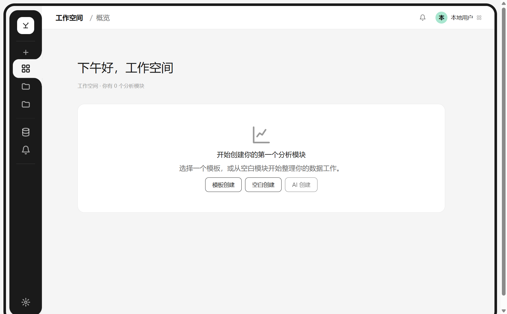<br/><sub>深色图标栏（76px 折叠态）</sub></td>
    <td align="center">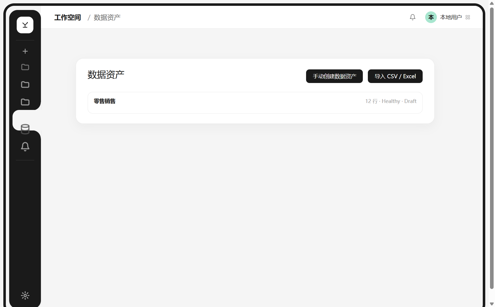<br/><sub>数据资产页（真实数据：12 行）</sub></td>
  </tr>
  <tr>
    <td align="center">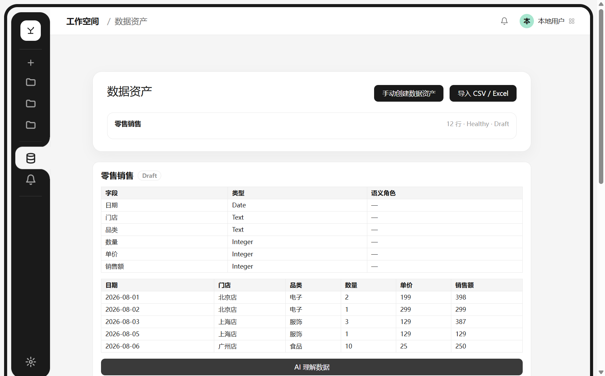<br/><sub>AI 理解 → 字段语义 + 指标建议（7 个提案）</sub></td>
    <td align="center">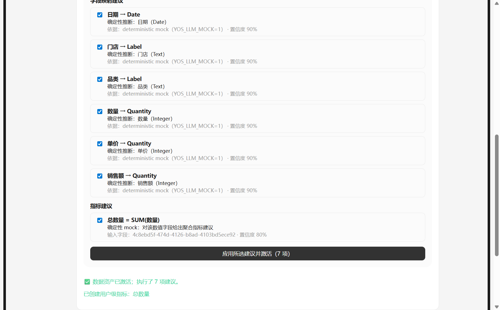<br/><sub>确认激活 → 指标入库</sub></td>
  </tr>
  <tr>
    <td align="center">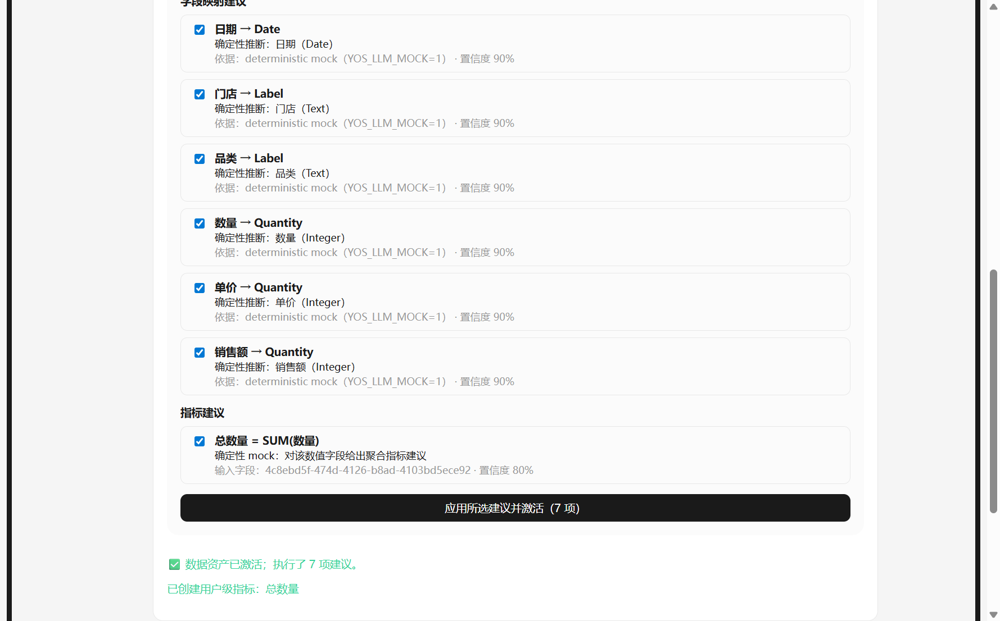<br/><sub>悬浮时：active wave 跟随 + 图标放大</sub></td>
    <td align="center"><br/><sub>停留 300ms → 展开 200px（不推动主内容）</sub></td>
  </tr>
  <tr>
    <td align="center">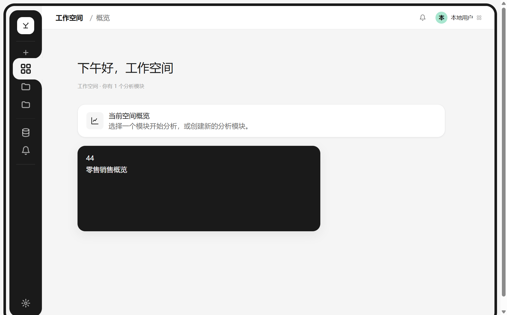<br/><sub>空间概览：模块卡显示真实 KPI（44）</sub></td>
    <td align="center">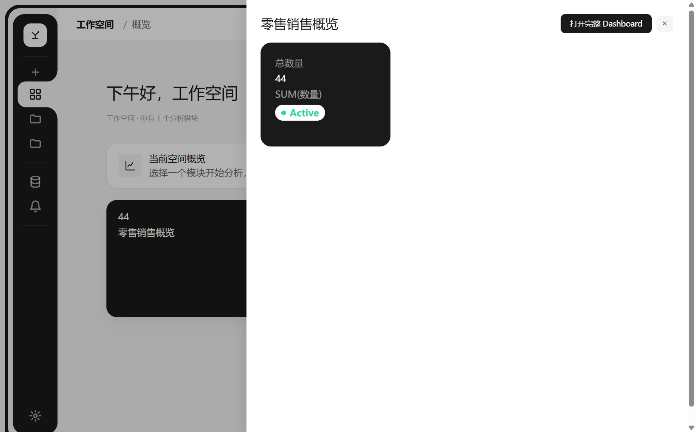<br/><sub>快速预览：KPI 卡（总数量 = 44）</sub></td>
  </tr>
  <tr>
    <td align="center">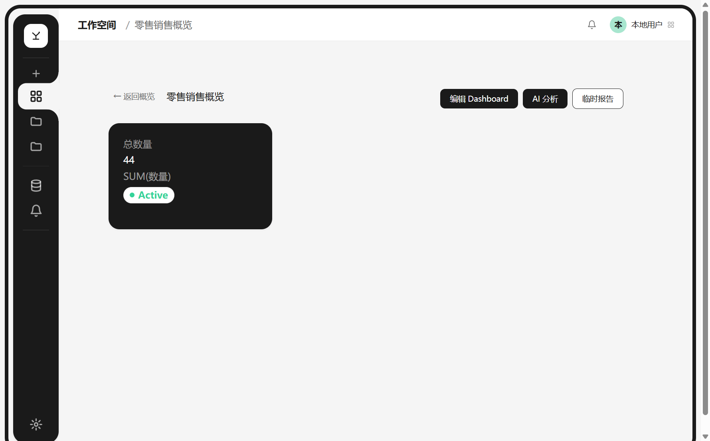<br/><sub>Dashboard（指标卡：确定性计算结果）</sub></td>
    <td align="center">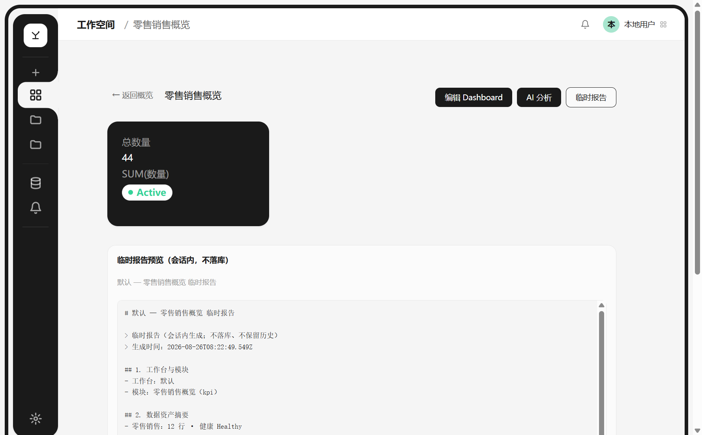<br/><sub>临时报告（Markdown 预览）</sub></td>
  </tr>
  <tr>
    <td align="center">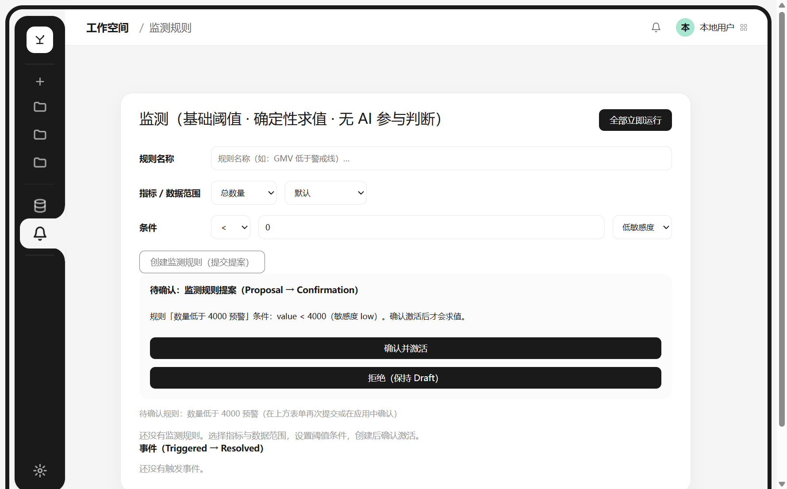<br/><sub>监测规则 Proposal → 用户确认</sub></td>
    <td align="center">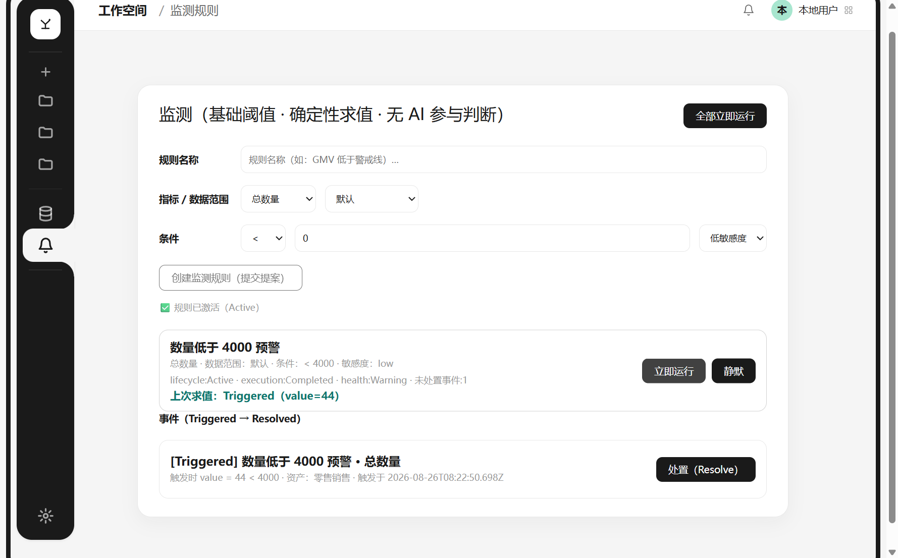<br/><sub>异常触发（44 < 4000）→ [Triggered]</sub></td>
  </tr>
  <tr>
    <td align="center">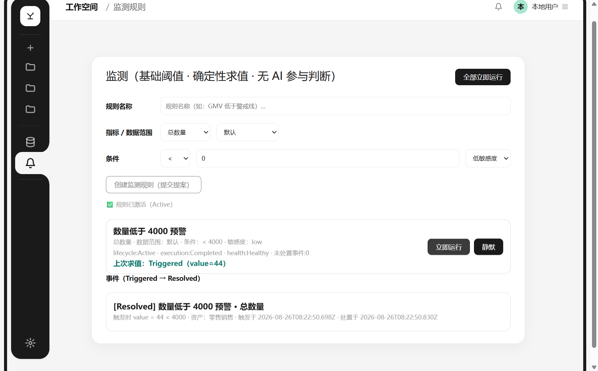<br/><sub>用户处置 → [Resolved]（全过程留痕）</sub></td>
    <td></td>
  </tr>
</table>

> 截图为真实运行验证：导入 12 行零售销售 CSV → AI 理解（7 提案）→ 确认激活 → 指标 `总数量 = SUM(数量) = 44` → 模块/Dashboard → 监测触发与处置。UI 动效（wave/展开）为实测时序截图。

---

## 四、技术架构

```
┌─────────────────────────────────────────────────────────┐
│  Renderer (React 19 + Vite)                              │
│  组件: Sidebar(76px↔200px overlay) · SpaceView ·          │
│        Dashboard · Monitoring · Report                   │
└──────────────────────┬──────────────────────────────────┘
                       │ preload IPC（contextIsolation）
┌──────────────────────▼──────────────────────────────────┐
│  Main (Electron 42)   ── 组合根 / IPC 运行时校验          │
│  UseCase: 导入·理解·确认·指标·分析·监测·报告               │
│  Agent: 意图路由（只读白名单 8 intents，零写）            │
├─────────────────────────────────────────────────────────┤
│  Domain / Application（业务规则·状态机·确定性公式·Proposal）│
├─────────────────────────────────────────────────────────┤
│  SQLite（目录/实体/配置）  +  DuckDB（原始记录/分析）       │
│  本地权威 · 无云 · 数据可迁移                              │
└─────────────────────────────────────────────────────────┘
              ▲ OpenAI 兼容 LLM（仅理解/解释/建议，不计算）
```

**技术栈**

| 层 | 选型 |
|---|---|
| 桌面运行时 | Electron 42 · contextIsolation · DB 只在 main |
| 前端 | TypeScript（strict）· React 19 · Vite |
| 数据库 | better-sqlite3 + Drizzle（目录）· DuckDB（记录 + 确定性分析） |
| 工程 | pnpm workspaces + Turborepo · Vitest 201 tests · Playwright E2E |
| 质量 | ESLint 架构守卫（禁止 Agent→数据库 等跨层 import）+ 依赖隔离 |
| AI | 自建 LLMClient 薄抽象（OpenAI 兼容）+ 用量计量；Mock 注入可验证链路 |

**关键工程设计（详阅 `docs/`）**

- `docs/architecture/domain-model.md` — 领域模型：数据资产 = 用户级顶层共享资产（一份原件、Mount 复用、删除不损坏）
- `docs/architecture/agent-architecture.md` — Agent 调用链：`Agent → Tool → Application → Domain → Repo → Data`；Agent 永不直连 DB
- `docs/architecture/permission-model.md` — 权限 L0–L3 × 确认政策 A/B/C/D（删除原始数据 = 永不自动）
- `docs/architecture/state-model.md` — 三轴状态机（Lifecycle × Execution × Health 正交）
- `docs/memory/decisions/` — 11 篇决策 ADR（含"为什么否决其它方案"）
- `docs/product/PRD.md` — 产品需求（核心闭环 / MVP 边界 / 路线 V1-V2）
- `docs/design/design-system.md` — 设计系统与 Token

---

## 五、工程与验证亮点

- **架构守卫**：pnpm 依赖隔离 + ESLint 自定义规则强制分层边界（Agent→数据库 直接 import 会构建失败）
- **验证基线**：`pnpm verify`（typecheck + lint + **201 tests** + build）全绿；E2E 冒烟通过
- **全链路真实数据验证**：导入→理解（7 提案）→确认→指标=44→Dashboard→监测触发→处置→报告，**14/14 断言通过**（自动化探针复用）
- **安全加固**（ADR 009–011）：CSP、IPC 发送方校验与**运行时 payload 校验**、safeStorage 密钥存储、DuckDB 失败**快速失败**（不静默降级内存）、迁移前自动备份
- **协作与版本管理**：产品讨论 / 工程执行双角色流程；安全版本 `safe-v1/v2/v3`（commit+tag+回滚指南）

---

## 六、如何运行（开发预览）

```bash
pnpm install
pnpm dev            # Electron 开发模式
# 首次体验：设置中配置 OpenAI 兼容 LLM，或用演示模式：
YOS_LLM_MOCK=1 pnpm dev   # 确定性 Mock LLM（验证完整链路，无需真实 API Key）
```

> 运行数据全在本地（`yos.db + records/*.duckdb`），导入/分析/监测/报告全链路无需网络（除 LLM 能力调用）。

---

## 七、路线（规划中）

1. **S1 验证**：单机 MVP 用户验证（当前阶段）——种子用户真实数据闭环
2. **S2 能力面**：云同步/备份/计量、数据源扩展（API/OAuth）、正式报告中心、**Agent 记忆与学习**（个人画像 + 证据驱动的确定性记忆，用户可见可删）、Agent 写能力（propose→确认→执行）
3. **S3 扩圈**：小微团队协作；「个人数据资产」心智沉淀

---

> 完整源码（monorepo：9 packages、201 tests、E2E 与自动化探针）保存在作者的私有仓库；如需审阅请联系 GitHub [@heng628](https://github.com/heng628)。

